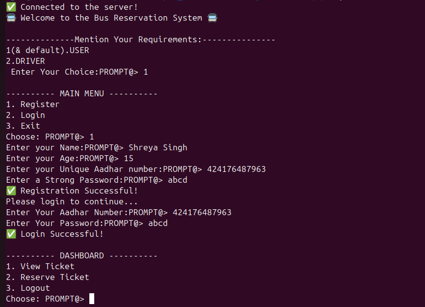
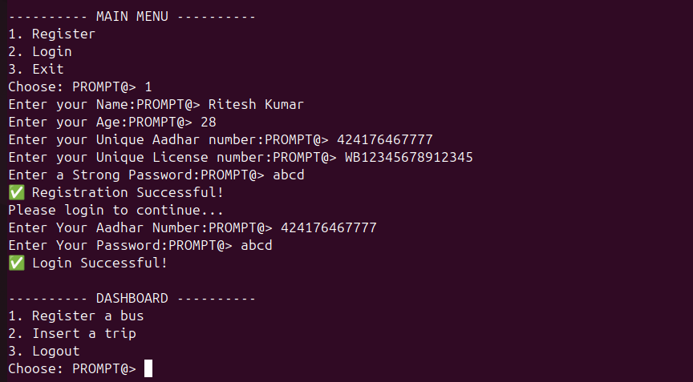
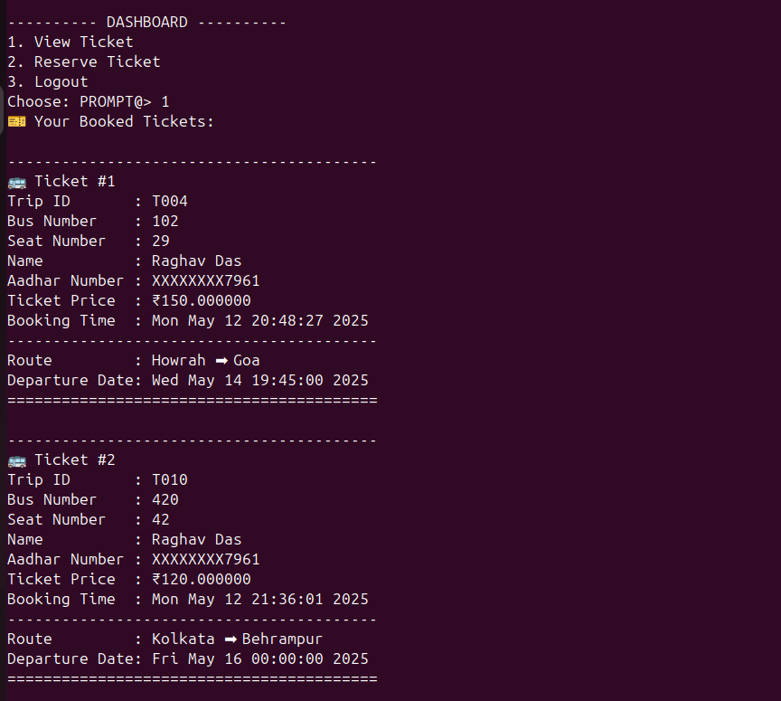
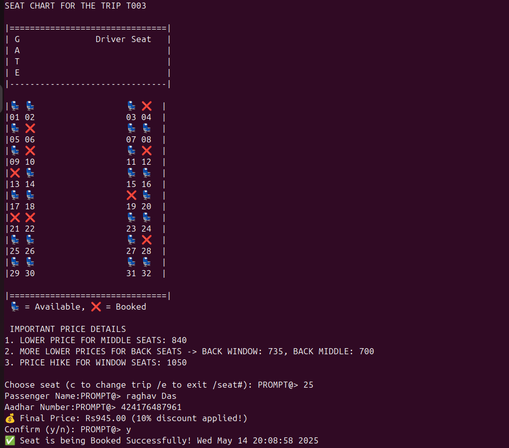
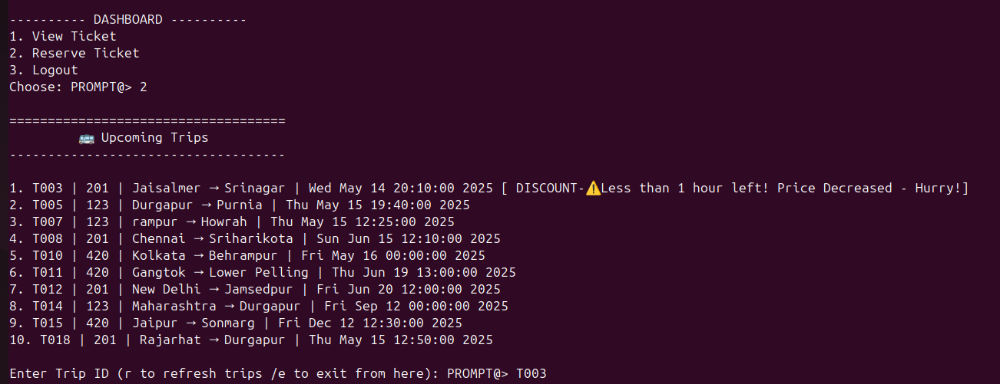

# Bus Reservation System Management in C++


This repository contains the Bus Reservation System Management project developed using OS concepts in C++.

## Table of Contents

- [Bus Reservation System Management in C++](#bus-reservation-system-management-in-c)
 - [Features](#Features)
 - [Screenshots](#screenshots)
 - [Getting Started](#getting-started)
    - [Prerequisites](#prerequisites)
    - [Installation](#installation)
    - [Compilation](#compilation)
    - [Running the Application](#running-the-application)
    - [Admin Credentials](#admin-credentials)
  - [File Structure](#file-structure)
  - [Classes and Methods](#classes-and-methods)
    - [User](#user)
    - [Driver](#driver)
    - [Reservation_Handler](#reservation-handler)
    - [bus_trip_handler](#bus_trip_handler)
  - [Utility Functions](#utility-functions)
  - [Team Members](#team-members)


## Features

- **Bus Management**: Insert(for drivers), view, and register trips.
- **Reservation System**: Book, view, and cancel reservations.
- **File Handling**: Persist bus and reservation data using file handling techniques.
- **User Interface**: Command-line based user interface for interacting with the system.

## Screenshots

- User login Screen



- Driver Login Screen



- Previous Bookings



- Book Ticket via bus matrix



- Upcoming trip details



- Log out / Disconnect


## Getting Started

To get started with the development or usage of this project, follow the instructions below:

### Prerequisites

- A C++ compiler (such as g++, clang++)
- A suitable development environment (such as Visual Studio, Code::Blocks, or a text editor with command line tools)

### Installation

1. Clone this repository to your local machine:

    ```bash
    git clone https://github.com/T-Soni/OS_BusReservationSystem.git
    ```

2. Navigate into the cloned repository directory:

    ```bash
    cd bus-reservation-system-cpp
    ```

3. lcrypto installation: Need to install before running the server. Use the comand line provided for installation.

     ```bash
    sudo apt install libssl-dev
    ```


### Compilation

To compile the project, you can use the following command in the terminal:

1. For Server 

    ```bash
    g++ newserver.cpp -o s -lcrypto
    ```

1. For Client 

    ```bash
    g++ cmine.cpp -o c
    ```


### Running the Application

After successfully compiling the project, you can run the application using the command:

1. For Server 

    ```bash
    ./s
    ```

1. For Client 

    ```bash
    ./c
    ```


## File Structure

The project directory typically contains the following files:

- `cmine.cpp`: The main entry point of the application including server client implementation.
- `newserver.cpp`: Contains all methods and classes used in the project.
- `users.txt`: The details of the users stored here after successful registration.
- `drivers.txt`: A file containing all the details regarding successfully registered drivers.
- `buses.txt`: Information regarding buses present. 
- `trips.txt`: The trips present in our project.
- `bookings.txt`: A file contains all the confirmed bookings.
- `seatT00X.txt`: The seat matrix of the trips existing in our project.
- `screenshots/`: The folder containing all the screenshots of the project.

### Classes and Methods 

- **User**
  - `registerUser(sock)`: Registers a new user using Aadhar and name.
  - `login(sock)`: Logs in a user by validating credentials.

- **Driver**
  - `registerDriver(sock)`:  Registers a driver with license ID and name.
  - `loginDriver(sock)`: Authenticates a driver based on ID and name.

- **Reservation_Handler**
  - `viewTickets(sock)`:  Displays tickets booked by the user.
  - `viewTrips(sock)`: Lists upcoming trips (excludes expired ones).
  - `reserve(sock)`: Full flow to select a trip and book a seat.

- **bus_trip_handler**
  - `registerBus(sock)`:Adds a new bus with seat layout.
  - `insertTrip(sock)`: Assigns a trip with time, date, source, and destination.
  - `createSeatFile(tripId, rows, cols)`: Generates seat layout file for the trip.

### Utility Functions

- File I/O: `readFile()`, `updateFile()`, `writeFile()`, `escapeCSV()`
- Security: `hash_password()`
- Time: `timeToMinutes()`, `isTimeDifferenceSafe()`, `isDateTimeAfterNow()`, `getTimeFromDateTime()`
- Seat Booking: `bookSeat()`, `seatMatrix()`
- Communication: `sendPrompt()`, `receiveInput()`
- Validation: `isValidAadhar()`, `isAadharExist()`, `isValidLicense()`, `isLicenseExist()`


## 👥 Team Members

- **Tanushree Soni and Sutapa Naskar** – Lead Developer, Backend logic
- **Nilesh Agrawal and Sai Charan** –  Reservation logic and Seat Matrix Design
- **Vishnuvardhan Reddy and Akash** – Driver & Trip Management Module
- **Koustav Das and Purna Siva** – File Handling and Data Validation
- **Atul Singh and Aditya Kumar Patika** – PPT making and documentation 


